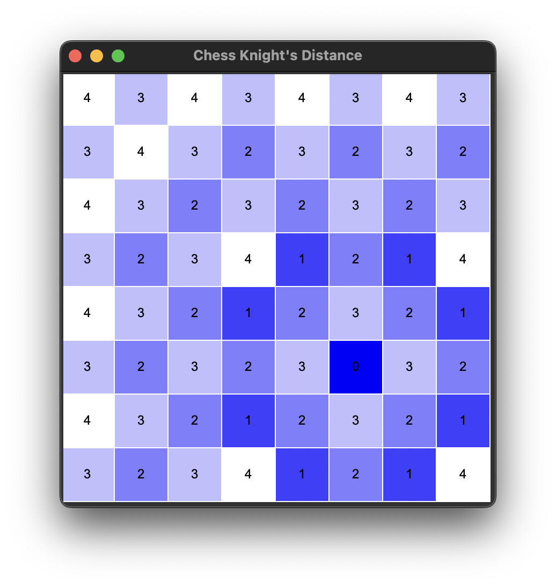

# Chess Knight's Distance Visualization

This Python program uses the Tkinter library to create a simple chessboard where you can explore the distances a chess knight can move from a selected square. It visualizes these distances by coloring the squares on the board based on the number of knight's moves required to reach them.



## Features

- Click on any square on the chessboard to highlight the reachable squares for a knight placed on that square.
- The program uses different colors to represent the number of moves required to reach each square.
- You can toggle the display by clicking on the same square again to reset the chessboard.

## Prerequisites

- Python 3.x
- Tkinter library
- NumPy library

## Installation

1. Clone this repository to your local machine using `git clone`.
2. Make sure you have Python 3.x installed.
3. Install the required libraries using pip:

   ```bash
   pip install numpy python-chess
   
## Usage


Run the program by executing python chess_knight_distance.py.
A window will open displaying the chessboard.
Click on any square to see how far a knight can move from that square.

## How it Works

The program calculates the knight's distance for each square on the chessboard using a 2D NumPy array. It then maps these distances to colors to create a visual representation of the knight's movement range.
Acknowledgments

This program was created by [Your Name] as a simple visualization tool for understanding how chess knights move on a chessboard.
License

This project is licensed under the MIT License - see the LICENSE.md file for details.
Contributing

Contributions are welcome! If you'd like to improve the program or add new features, please open an issue or create a pull request.
Contact

If you have any questions or suggestions, feel free to contact.

Happy exploring the world of chess knight movements!
